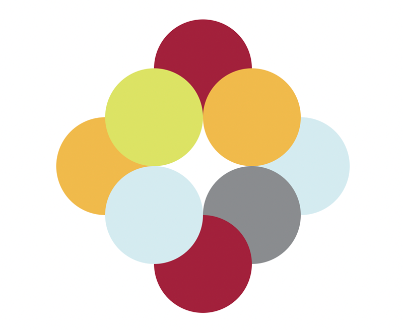

# Shapes
Exercise

## Description:
This is a fun exersice to practice html and css properties, from MITxPro full-stack Developer certification

## Usage:
This is a really good exercise to practice css properties, as positioning and z-index



## Installation
```
<html>
    <head>
        <style>
            html{
            width: 100%;
            height: 100%;
        }
        .container{
            width: 600px;
            height: 600px;
            left: 50%;
            margin-left: -300px;
            top: 50%;
            margin-top: -300px;
            position: relative;
        }
            .circle{
                position: absolute;
                z-index: 1;
                width:200px;
                height: 200px;
                border-radius: 50%;
                background-color: black;
                top: 50%;
            }
            .green{background-color: #dce364;}
            .red{background-color: #a2213b;}
            .yellow{background-color: #f1ba4b;}
            .l-blue{background-color: #d3ebf0;}
            .grey{background-color: #898c8f;}
            .uno{z-index: 0;top:0; left: 200px;}
            .dos{z-index: 3;top:100px; left: 300px;}
            .tres{z-index: 0;top:200px; left: 400px;}
            .cuatro{z-index: 1;top:300px; left: 300px;}
            .cinco{z-index: 2;top:400px; left: 200px;}
            .seis{z-index: 3;top:300px; left: 100px;}
            .siete{z-index: 0;top:200px; left: 0;}
            .ocho{z-index: 3;top:100px; left: 100px;}
        </style>
    </head>
<div class="container">

<div class="circle red uno"></div>
<div class="circle yellow dos"></div>
<div class="circle l-blue tres"></div>
<div class="circle grey cuatro"></div>
<div class="circle red cinco"></div>
<div class="circle l-blue seis"></div>
<div class="circle yellow siete"></div>
<div class="circle green ocho"></div>
</div>
</html>
```

